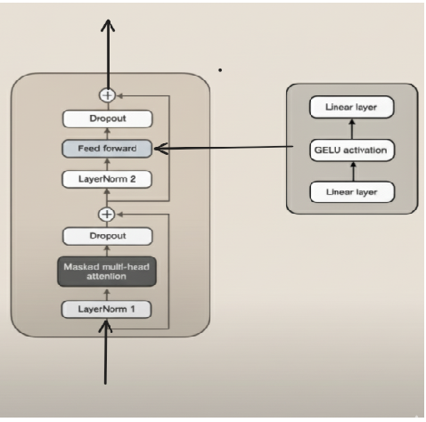
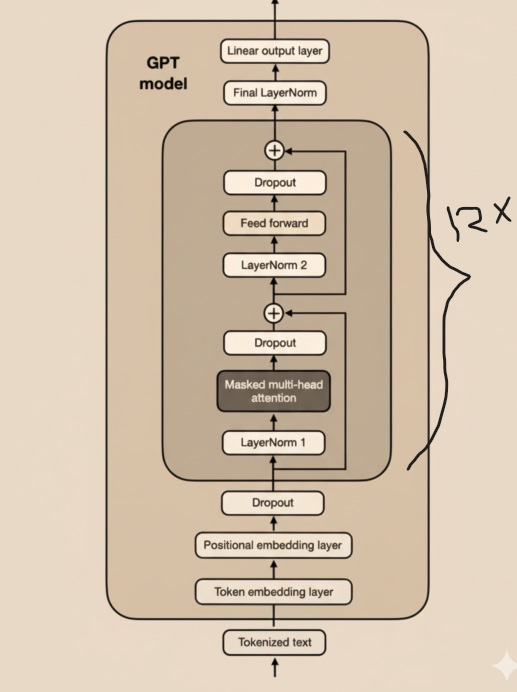

<!-- # GPT-2-FROM-SCRATCH
IMPLEMENTING GPT-2 (124 million parametrer) LLM FROM SCRACTH -->
# GPT-2 from Scratch: Complete Implementation 
A educational implementation of OpenAI's GPT-2 (124M) model built from the ground up using PyTorch. This project covers the full transformer architecture, training pipeline, and weight loading from pre-trained checkpoints.

## 🎯 Project Overview

This repository demonstrates how to build a production-ready GPT model by implementing every component from first principles. Whether you're a student learning transformer architectures or a developer exploring language models, this project provides clear, well-documented code that bridges theory and practice.

**Key Achievements:**
- 163M parameter GPT-2 model fully implemented
- Multi-head attention mechanism with causal masking
- Complete training and evaluation pipeline
- Weight loading from official OpenAI checkpoints
- Advanced text generation with temperature and top-k sampling

## 🏗️ Architecture Components

### Core Building Blocks

**Multi-Head Attention**
The backbone of the transformer. Implements scaled dot-product attention with multiple parallel attention heads, allowing the model to attend to different representation subspaces. Features include causal masking to prevent attending to future tokens.

**Transformer Block**
A complete transformer layer combining attention and feed-forward networks with residual connections and layer normalization. Uses pre-normalization (applying norm before the layer) for improved training stability.



**Feed-Forward Network**
A position-wise feed-forward network that expands embeddings to 4x their dimension through a GELU activation, then projects back. This acts as a learned non-linearity over the embedding space.

**Layer Normalization**
Custom implementation of layer normalization with learnable scale and shift parameters, ensuring stable training by normalizing activations across the embedding dimension.

**GELU Activation**
Gaussian Error Linear Unit activation function using the tanh approximation, providing smoother gradients than ReLU while maintaining strong model capacity.

## 📊 Model Configuration

```
GPT-2 (124M Parameters):
├── Vocabulary Size: 50,257 tokens
├── Context Length: 1,024 tokens
├── Embedding Dimension: 768
├── Attention Heads: 12
├── Transformer Layers: 12
├── Dropout Rate: 0.1
└── Total Parameters: 163,009,536
```

## ⚙️ Key Features

### Data Pipeline
- **Tokenization**: GPT-2 BPE tokenizer via tiktoken
- **Dataset Class**: Sliding window chunking with configurable stride for efficient memory usage
- **DataLoader Integration**: PyTorch-compatible batching with train/validation splits

### Training Capabilities
- Cross-entropy loss calculation across batches
- Separate train/validation evaluation loops
- Per-batch and per-loader loss computation
- Checkpoint-compatible architecture

### Text Generation
- **Greedy Decoding**: Select highest probability token at each step
- **Top-k Sampling**: Filter to top-k most likely tokens before sampling
- **Temperature Scaling**: Control randomness of generation (0.0 = deterministic, >1.0 = more random)
- **Context Management**: Automatic handling of context window limits

### Weight Loading
Direct loading of official OpenAI GPT-2 weights from TensorFlow checkpoints, enabling immediate use of pre-trained capabilities without retraining.

## 🚀 Quick Start

### Installation
```bash
pip install torch tiktoken tensorflow numpy requests tqdm
```

### Basic Usage

**Initialize and Generate Text:**
```python
from gpt_model import GPTModel, GPT_CONFIG_124M

model = GPTModel(GPT_CONFIG_124M)
model.eval()

# Generate text with sampling
token_ids = generate(
    model=model,
    idx=text_to_token_ids("The future of AI", tokenizer),
    max_new_tokens=50,
    context_size=1024,
    top_k=50,
    temperature=1.2
)
```

**Training on Custom Data:**
```python
train_loader = create_dataloader_v1(
    txt=your_training_text,
    batch_size=4,
    max_length=1024,
    stride=1024
)

optimizer = torch.optim.AdamW(model.parameters(), lr=0.0004)
train_model_simple(model, train_loader, val_loader, optimizer, device)
```


## 🔍 Understanding the Code

### Token to Text Flow
1. Raw text → BPE tokenization (50,257 vocab)
2. Token IDs → Embedding lookup (768-dim vectors)
3. Add positional embeddings (1,024 positions)
4. Pass through 12 transformer blocks
5. Layer norm and output projection
6. Logits → Probabilities → Token selection

### Attention Mechanism Deep Dive
- Queries, keys, values projected from input
- Split across 12 attention heads (64-dim each)
- Compute scaled dot-product similarity
- Apply causal mask (upper triangular)
- Softmax to attention weights
- Aggregate values, concatenate heads
- Final projection to output dimension

### Training Loop
1. Forward pass through model
2. Compute cross-entropy loss on target tokens
3. Backpropagate gradients
4. Update weights with AdamW optimizer
5. Evaluate on validation set
6. Generate sample text for inspection

## 📈 Performance Metrics

- **Model Size**: 498MB (weights only)
- **Inference Speed**: Token generation at ~50-100 tokens/second (GPU)
- **Training**: ~1-2 hours per epoch on large datasets (NVIDIA GPU)
- **Memory**: ~2GB VRAM for inference, 8GB+ for training

## 🎓 Learning Outcomes

After studying this codebase, you'll understand:
- How transformer models process sequential text
- Multi-head attention and why it works
- Positional encoding and its role in sequence modeling
- Causal masking for autoregressive generation
- Training dynamics of large language models
- Weight initialization and transfer learning


## 📚 Resources

- [Attention is All You Need](https://arxiv.org/abs/1706.03762) - Original Transformer paper
**Video Tutorials:**
- [Lecture 1: Building LLMs from Scratch - Series Introduction](https://youtu.be/Xpr8D6LeAtw?si=5VK1Rbq-c_4UhdS-) - Comprehensive introduction to building language models from the ground up

## 📝 Dataset Considerations

This implementation includes a Wikipedia data scraper that:
- Collects articles from multiple knowledge domains
- Cleans markup and formatting
- Produces ~3M tokens (~12MB) of training data
- Automatically handles text normalization

For optimal results, use datasets containing:
- Diverse writing styles and vocabularies
- Well-structured sentences
- Clear semantic content
- At least 1-2GB of text for meaningful training

## ⚖️ License

This educational implementation is provided as-is for learning and research purposes.

## 🤝 Contributing

Contributions welcome! Areas for improvement include:
- Performance optimizations
- Additional documentation
- Example notebooks
- Benchmark comparisons
- Bug fixes and code cleanup

---

**Note**: This is an educational implementation. For production use, consider using established libraries like Hugging Face Transformers, which provide optimized inference, extensive model variants, and community support.